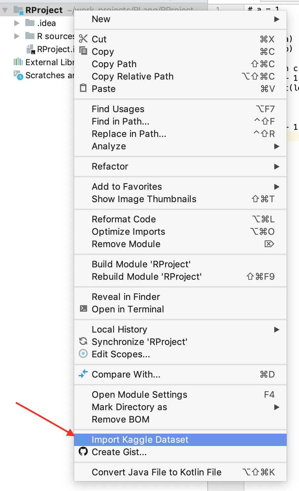

## Download Kaggle datasets from the IDE
Kaggle is an online community of data scientists and machine learners, owned by Google LLC. Kaggle allows users to find and publish data sets,
explore and build models in a web-based data-science environment, work with other data scientists and machine learning engineers,
and enter competitions to solve data science challenges.

This plugin adds action to download Kaggle datasets from the IDE.
